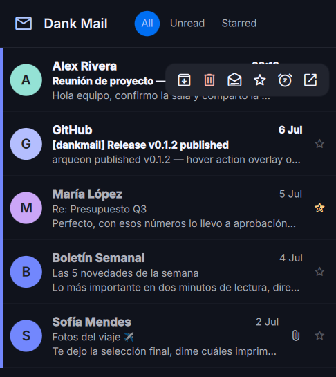

# dankmail

> Multi-account mail **notifier with triage** for Linux — a Go daemon
> plus a Quickshell/QML UI in the DankMaterialShell aesthetic,
> architecturally modeled on
> [dankcalendar](https://github.com/AvengeMedia/dankcalendar).
> Functionally inspired by Checker Plus for Gmail, but native,
> browser-independent, and with generic IMAP support.

<p align="center">
  
</p>

**Status: working (ring 1 complete + most of ring 2's UI).** Gmail
accounts sync, notify and triage end to end. Generic IMAP accounts can
be added and verified (their sync engine lands in ring 2). See
[docs/architecture.md](docs/architecture.md) for the design and the
delivery rings.

Triage, not management: anything the features below don't cover opens
your webmail via deep link. "Delete" always means *move to trash* —
permanent deletion is not implemented, by design.

## Features

### Daemon first
- Runs as a **systemd user service**; sync and notifications never
  depend on a window being open.
- The daemon **owns the UI lifecycle**: closing the window (or the
  whole Quickshell process) changes nothing; `dmail show`, the tray, or
  the bar plugin bring it back on demand.
- Tray icon with unread tooltip and a menu that separates *close the
  interface* from *stop dankmail completely*.

### Sync engine
- **Gmail via the official API** (not IMAP): initial sync + incremental
  History-API sync with cursor, automatic full resync when the cursor
  expires.
- **Optimistic operation queue**: every action applies locally at once,
  then executes remotely with retries and exponential backoff; typed
  errors decide retry vs. permanent (permanent failures revert the
  local change and notify); auth errors pause the account until
  re-consent. Homogeneous operations coalesce into batches.
- **Reconciliation invariant**: the server is the authority, except
  threads with in-flight operations, which stay frozen until resolved.
- **Retention janitor**: cache pruned beyond 30 days (configurable) —
  starred and snoozed threads exempt.

### Notifications
- Native D-Bus notifications with **configurable inline actions**
  (mark read / archive / trash / snooze / open in web — pick and order
  them), `notify-send` fallback.
- **Configurable snooze meaning** for one-click contexts: in 1 hour,
  this evening, tomorrow, later this week, this weekend, next week, or
  fixed minutes.
- Do-not-disturb toggle (tray, window, plugin, CLI).
- Alerts for permanently failed operations and accounts needing
  re-authentication; a notice when a snoozed thread wakes.

### Triage window (Quickshell/QML, DMS aesthetic)
- **Gmail-style unified list** across accounts: sender avatars with
  stable per-sender colors, bold-unread emphasis, per-account color
  bars and filter dots, unread/starred filters, attachment paperclips.
- **Plain-text preview** that stays plain but reads rich: quote chains
  rendered as indented colored blocks, the HTML→text distiller's light
  markdown rendered (labeled links, bold, headings), URLs clickable,
  **HTML-only mail distilled to text** instead of showing empty.
- **Recipient headers**: sender address plus the To/Cc lists of the
  shown message, with a hint when the mail arrived via BCC (your
  address in neither).
- **Attachments as metadata chips** (name, type, size — content never
  downloaded; opening goes to the webmail), capped at two rows and
  scrollable beyond.
- **Quick reply** under the preview: plain text, Ctrl+Enter sends,
  reply-all as a toggle, correct threading (In-Reply-To/References).
- **Compose** with sender-account selector and **contact
  autocomplete**: correspondents inferred from your mail plus Google
  Contacts / Gmail's autocomplete pool via the People API (optional,
  read-only scopes).
- **Search, three levels deep**: instant filter over the local cache →
  one click sweeps your **entire mailbox history** server-side (Gmail
  search syntax works: `from:`, `has:attachment`, `before:` …) and
  ingests results for local triage → one more click continues in the
  webmail.
- **Spam review**: a Spam tab lists the spam folder (synced but never
  notified) with a one-click **mark-all-read** to leave it reviewed;
  `dmail sync --full` backfills it on accounts added before this
  feature.
- **Snooze** with quick options and a **calendar + time picker**;
  snoozes survive daemon restarts and cancel automatically if the
  thread changes remotely.
- **Settings window**: notification buttons, snooze preset, chained
  actions, account management — everything applies live. Expired or
  revoked OAuth tokens re-authenticate with **one click** (the key
  button), reusing the stored client credentials.
- **Chained actions** (configurable): open-preview→mark read,
  reply→mark read, trash→mark read, star→back to inbox.
- Spanish and English out of the box — UI, notifications and CLI all
  follow `DMAIL_LANG` or the system locale (English default); follows
  DankMaterialShell's dynamic Material colors.

### Accounts
- **Multi-account** by design: unified chronological inbox with color
  identity, per-account filtering, deep links that select the right
  Gmail session (`authuser`).
- **Guided Gmail wizard**: the daemon serves a step-by-step Google
  Cloud walkthrough (with direct links and the classic pitfalls called
  out); paste the Client ID/Secret, drop the downloaded
  `client_secret_*.json` onto the wizard, or point it at the file's
  path. Minimal mail scopes — `gmail.modify` +
  `gmail.send`, **never** full mailbox access. The last step publishes
  your OAuth app so Google doesn't expire its tokens every 7 days.
- **IMAP accounts** (iCloud, Yahoo, Fastmail, Proton via Bridge,
  custom) with presets and a **real connection test** before anything
  is stored; they park until the ring-2 IMAP engine. Microsoft via
  Graph API is planned (see
  [docs/design/providers-roadmap.md](docs/design/providers-roadmap.md)).
- **Secrets live in the system keyring**: tokens, passwords, and your
  own OAuth client (so refresh works no matter how the daemon starts).

### Scriptable
- **Unix-socket IPC** (line-JSON) with the full surface: threads, ops,
  search, contacts, settings, DND, UI control (`ui.showThread`,
  `ui.compose`…), plus a subscription stream of daemon events.
- **CLI**: `dmail status | list --json | sync | dnd | toggle | open |
  config | account …`.
- **Localhost HTTP API** for widgets and bars.

### DankMaterialShell plugin
- [`dms-dankmail`](https://github.com/arqueon/dms-dankmail)
  (`dankmailUnread`): live unread badge over the IPC socket — no
  polling — with a popout showing the latest inbox mail with
  per-message actions (read / archive / trash / snooze / open); click
  a mail to jump to it in the triage window; compose, sync and DND
  from the popout header.

## Install

### Arch Linux (AUR)

[`dankmail`](https://aur.archlinux.org/packages/dankmail) (latest
release) or [`dankmail-git`](https://aur.archlinux.org/packages/dankmail-git)
(builds from `main`):

```sh
paru -S dankmail        # or: yay -S dankmail
systemctl --user enable --now dmail
```

### From source

```sh
git clone https://github.com/arqueon/dankmail && cd dankmail
make build
make install PREFIX=~/.local          # or sudo make install
make install-systemd PREFIX=~/.local
systemctl --user enable --now dmail
```

Requirements: Go ≥ 1.22 to build; [Quickshell](https://quickshell.org)
for the UI; a Secret Service keyring and a notification daemon in your
session (DankMaterialShell covers both).

### Where's the window?

The systemd service starts the daemon **hidden** (`dmail run
--hidden`): nothing opens on screen — dankmail lives in the system
tray. That's by design; it's a notifier, not an app you keep open.
To bring up the triage window:

- click the **tray icon** (right-click for sync / DND / quit),
- launch **Dank Mail** from your app menu (it runs `dmail show`),
- or run `dmail show` / `dmail toggle` — handy for a compositor
  keybind.

If you see no tray icon either, your bar needs a StatusNotifier tray
(DankMaterialShell, waybar `tray` module, etc.); the window is still
reachable with `dmail show`.

## Accounts

- **Gmail**: window → add-account button; the wizard walks you through
  everything. CLI: `dmail account add-gmail --client-json
  ~/Downloads/client_secret_*.json`. See
  [docs/gmail-setup.md](docs/gmail-setup.md).
- **IMAP**: presets in the same wizard, or `dmail account add-imap
  you@icloud.com --preset icloud`.

## Notes

- Snooze is simulated locally (archive + scheduled wake): it won't
  show in Gmail's own "Snoozed" view — snoozed mail sits in "All
  Mail" meanwhile — and waking requires the daemon to be running
  (overdue snoozes are picked up on the next start).
- New-mail latency follows the polling interval (default 60 s per
  account); real push is a ring-3 item.

## License

GPL-3.0-or-later — see [LICENSE](LICENSE). The Quickshell UI adapts
MIT-licensed infrastructure from dankcalendar (Avenge Media LLC); the
original notices are preserved in `quickshell/NOTICE`.
