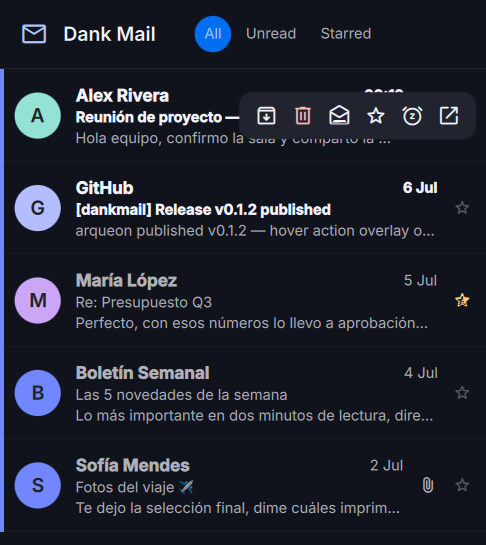

# 📬 dankmail

> **Triage your inbox, preserve your focus.**  
> A lightning-fast, keyboard-driven mail triage system for Linux: a unified multi-account inbox, local-first cache, and distraction-free plain-text markdown distiller. Ships as a **standalone desktop app** (Go daemon `dmail` + Quickshell UI) **and** an optional **DankMaterialShell** widget — the same `dmail` daemon powers both.

<p align="center">
  
</p>

---

## 🗂️ Two artifacts, one project

`dankmail` ships **two things** from this repository:

| Artifact | What it is | Requires |
|---|---|---|
| **dankmail** (app) | Standalone mail-triage desktop app: `dmail` daemon, CLI, and Quickshell UI. Works on any Wayland compositor. | Go, Quickshell |
| **Dankmail Unread** (plugin) | Optional DankMaterialShell bar widget (unread capsules, triage popout) that talks to the same `dmail` daemon. | DMS + dankmail |

The app is fully functional on its own; the plugin is an optional shell integration, **not** a separate mail client. Plugin source lives in [`dms-plugin/`](dms-plugin). On Arch Linux, install `dms-shell-plugin-dankmail`; from source, run `make install-dms-plugin`. Starting with 0.3.6, the companion follows the app release version.

---

## ⚡ The Philosophy

`dankmail` is **not a mail client** — it is a **mail controller**. 

Modern email clients are bloated, distract you with HTML tracking pixels, and suck you into endless threads. `dankmail` is built for power users who want to triage their mail, clear their inbox in seconds, and get back to work:

*   **Keyboard-driven flow:** Archive, delete, star, snooze, and reply in milliseconds.
*   **Zero distractions:** Distills complex HTML mail into clean, safe markdown. No web engines, no tracking scripts, no slow loading times.
*   **Local-first speed:** Everything runs over a local SQLite cache. Operations are optimistic and happen instantly, queued in the background.
*   **Invisible by default:** Lives in your system tray and starts instantly with a global hotkey or system bar trigger.

---

## ✨ Features at a Glance

### 🚀 Local-First Sync Engine
*   **Official Gmail API & Graph API:** Syncs using secure modern endpoints (not legacy IMAP).
*   **Optimistic Operation Queue:** Actions execute locally *instantly*, then sync to remote servers with exponential backoff and batch coalescing.
*   **Thread Freezing:** If sync occurs while you have pending actions, local edits are frozen so remote data never overwrites your current work.
*   **30-Day Auto-Janitor:** Automatically prunes local SQLite cache while keeping starred and snoozed threads safe.

### 🛡️ Distraction-Free Triage Window
*   **Indexed local search:** Find literal text in cached subjects, snippets, senders and bodies. Results load in pages of 200 with a **Load more** button; superseded requests cannot replace the current search. See [search behavior and validation](docs/search.md).
*   **HTML to Markdown Distiller:** Reads clean, stylized markdown. Indents quote chains with color coding and renders text links safely.
*   **Attachment Metadata Chips:** View file names and sizes instantly; opens webmail on click to keep heavy binary downloads off your machine.
*   **Quick Reply & Compose:** Write lightning-fast replies in plain text with full thread nesting (`In-Reply-To`/`References`).
*   **BCC Helper:** Warns you dynamically when you've received mail via BCC (your address isn't in To/Cc).
*   **Scrollable Recipients Header:** The To/Cc/Bcc recipient list adjusts automatically with text wrapping inside a custom `DankFlickable` panel, maintaining a clean header geometry regardless of the number of recipients.

### ⏳ Temporal Undo (Safety Net)
*   **40-Second Delay:** Destructive actions (Archive, Delete, Snooze, Unspam) are queued in the client with a 40-second grace period.
*   **Material 3 Undo Banner:** Shows a floating banner at the bottom with a prominent "Undo" button. Click it to instantly restore the thread's state.

### 🎨 Native Shell Integration
*   **DankMaterialShell Plugin:** The shell companion is part of this same Dankmail project—not a separate mail client—and uses the same `dmail` daemon. It provides live unread count capsules, truthful per-account counters, interactive triage actions, and a focused quick-reply entry. **This integration is optional — the app works standalone without DankMaterialShell.** Its canonical source ships in [`dms-plugin/`](dms-plugin) — install it with `make install-dms-plugin`.
*   **Dynamic Theme Sync:** Follows dynamic Material Design system colors (`dms-colors.json`).
*   **DMAIL_LANG Locale:** follows system language settings for English (`en`), Spanish (`es`), and Brazilian Portuguese (`pt`).

---

## 🛠️ Scripting & IPC (Unix Socket)

`dankmail` is fully scriptable. A background Go daemon exposes a unix-socket IPC (`$XDG_RUNTIME_DIR/dankmail.sock`) sending line-delimited JSON.

```bash
# Toggle the main triage window from a compositor shortcut (e.g. Niri / sway)
dmail toggle

# Query unread threads in JSON format
dmail list --unread --json

# Trigger a manual sync on all accounts
dmail sync
```

---

## 📦 Installation

### Arch Linux (AUR)

Install the stable release or the development package (`-git` follows the latest commits on `main`):

```bash
# Stable Release
paru -S dankmail
systemctl --user enable --now dmail

# Git Version
paru -S dankmail-git
systemctl --user enable --now dmail
```

For the optional DankMaterialShell companion:

```bash
paru -S dms-shell-plugin-dankmail
```

Enable **Dankmail Unread** in DMS Settings → Plugins, then add it to the bar.
The package installs a system plugin; it does not change your DMS settings.
If you already installed the companion from the DMS catalog or from source,
that user copy takes precedence. Keep using that copy, or move it out of
`~/.config/DankMaterialShell/plugins/` to switch to the AUR-managed version.

After upgrading DankMail, restart the daemon with `systemctl --user restart dmail`
(or `dmail restart`) and close/reopen the triage window. The first 0.3.6 startup
builds local search indexes; see [search behavior and migration](docs/search.md).

### From Source

Ensure you have **Go ≥ 1.22** and [Quickshell](https://quickshell.org) installed on your system:

```bash
git clone https://github.com/arqueon/dankmail && cd dankmail
make build
make install PREFIX=~/.local
make install-systemd PREFIX=~/.local
systemctl --user enable --now dmail

# Optional: DankMaterialShell bar widget (unread count + triage popout)
make install-dms-plugin
```

---

## 🔑 Account Setup

*   **Gmail**: Open the triage window, choose Add account → Gmail, and follow the guided OAuth assistant. Enable the Gmail and People APIs; dankmail requests `gmail.modify`, `gmail.send`, `contacts.readonly`, and `contacts.other.readonly`—never the unrestricted `mail.google.com` scope. Read [docs/gmail-setup.md](docs/gmail-setup.md) for details.
*   **Microsoft**: Choose Add account → Outlook / Microsoft 365. The assistant creates a public desktop client and signs in through Microsoft Graph with delegated `Mail.ReadWrite`, `Mail.Send`, `User.Read`, and `offline_access` permissions. No mailbox password or client secret is stored. CLI equivalent:
    ```bash
    dmail account add-microsoft --client-id <azure-client-uuid>
    ```
*   **Generic IMAP**: Fastmail, iCloud, Yahoo, and Proton Bridge presets are supported and parked in Ring 2. Outlook is intentionally not offered through password-based IMAP; use the native Microsoft OAuth provider.

Compose and quick-forward recipient fields share the same autocomplete index: Google People contacts plus addresses learned from cached mail.

---

## 📜 License

Distributed under the **GPL-3.0-or-later** license. See [LICENSE](LICENSE) for details.  
UI components utilize modified parts of the MIT-licensed infrastructure from `dankcalendar` (Avenge Media LLC), preserved in `quickshell/NOTICE`.

### Archived mail

Choose **Archived** to load archived history from Gmail, including unstarred mail that has never been cached. **Load older archived mail** retrieves the next provider page; **Load more** displays more already-cached results. Conversations are sorted by newest message, with spam, trash, drafts and snoozed mail excluded. Account filtering and local search remain available. Browsed history stays cached for the retention period after loading, without new-mail notifications. Providers without archive-history support show cached results with an explicit notice.

## Mailbox updates and reading

Synchronization checkpoints downloaded batches, so a quota pause or restart can
resume without discarding all earlier progress. A slow account does not block a
manual sync of the others. Account settings show the last completed sync and errors.

**Sent** loads recent outgoing conversations from Gmail or Microsoft in pages of
25, with an explicit control for older mail. **Not spam** is available for the
open conversation and bulk selections, including selections across accounts.

The reader formats distilled text into paragraphs, lists, quotes, tables and code
blocks. Links allow HTTP(S) and mailto only; remote images and original message
HTML are not loaded. Button styling follows DankCalendar and DMS theme colors.

### Companion maintenance

The [DMS companion guide](dms-plugin/README.md#controls-and-connection-status)
explains the Inbox/Starred popout, theme behavior, translations, and connection
recovery. A user-installed plugin or symlink takes precedence over the system
package; updating the package alone does not replace that copy.
